<h1>PROJET JEE -SPRING-ANGULAR-SPRING SECURITY-JWT</h1> 
<h2>Introduction<h2>

Le projet de gestion bancaire vise à développer une application 
complète permettant la gestion efficace des comptes bancaires.
Chaque compte est associé à un client et peut être sujet à diverses 
opérations telles que le débit et le crédit. Le système prend en charge
deux types de comptes : les comptes courants et les comptes épargnes.

<h2>Architecture de l'application</h2>
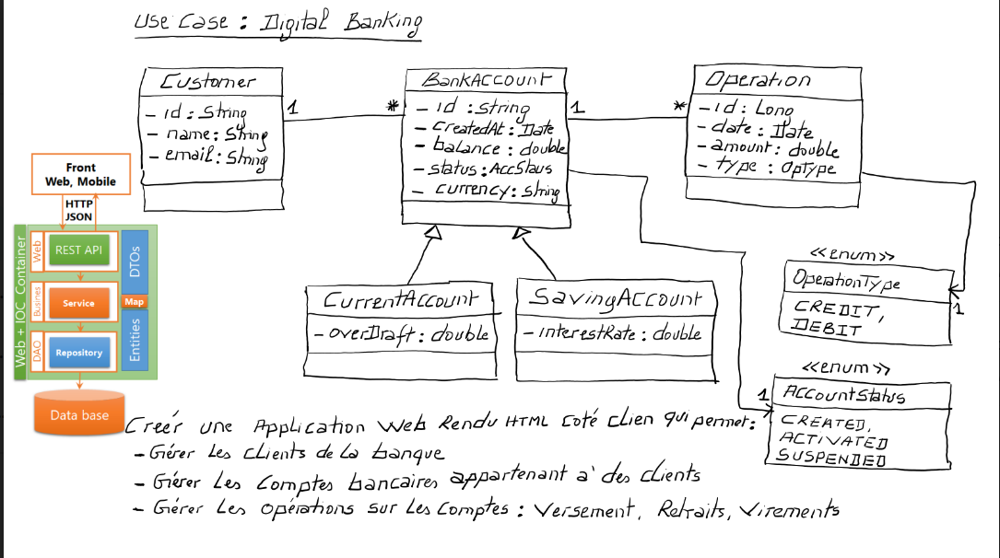
<h2>Partie 1 : Couche DAO</h2>

Dans cette section, nous avons créé un projet Spring Boot et
mis en place la couche d'accès aux données (DAO). Les entités JPA telles que Customer,
BankAccount, Saving Account, CurrentAccount, et AccountOperation ont été définies. 
Les interfaces JPA Repository basées sur Spring Data ont été mises en place pour interagir 
avec la base de données.Des tests ont été effectués pour valider le bon fonctionnement de la couche DAO.

<ol>
<li><h2>Entités JPA :</h2></li>
<h4>H2 DATABASE</h4>
     <h4>SINGLE TABLE</h4>

générer single table

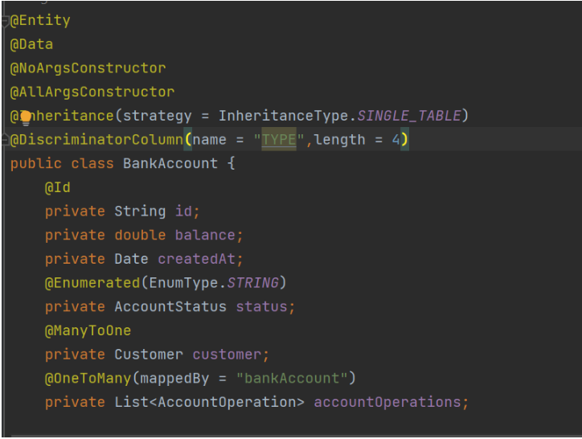

la valeur du type Saving Account

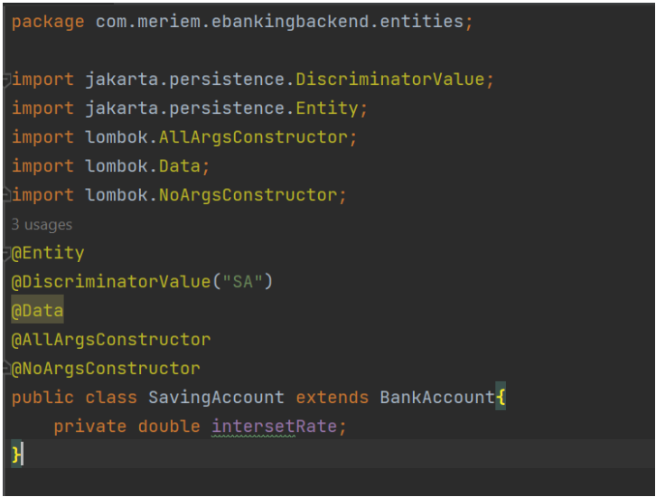

la valeur du type Current Account

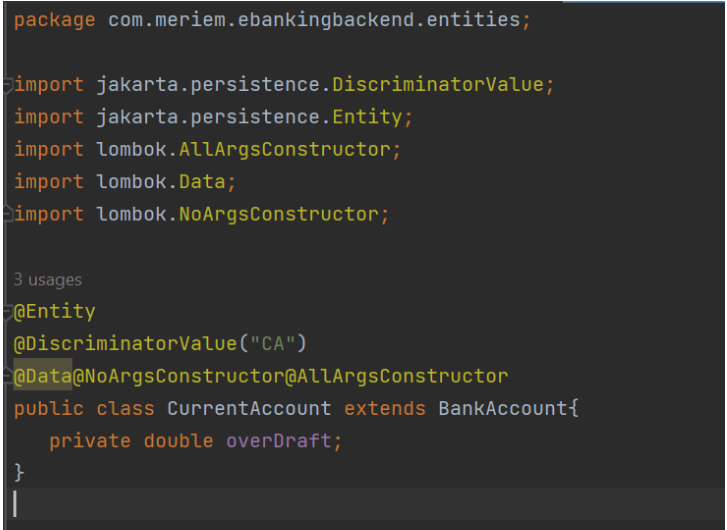

table Bank Account

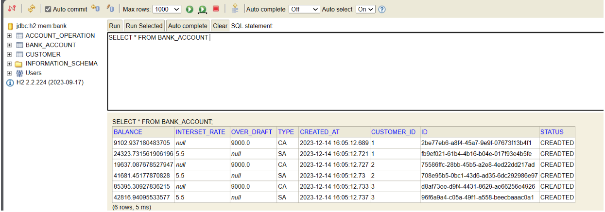

table Customer

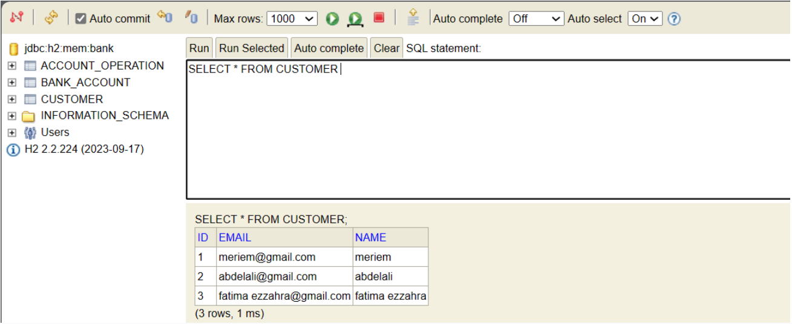

table Account Operation

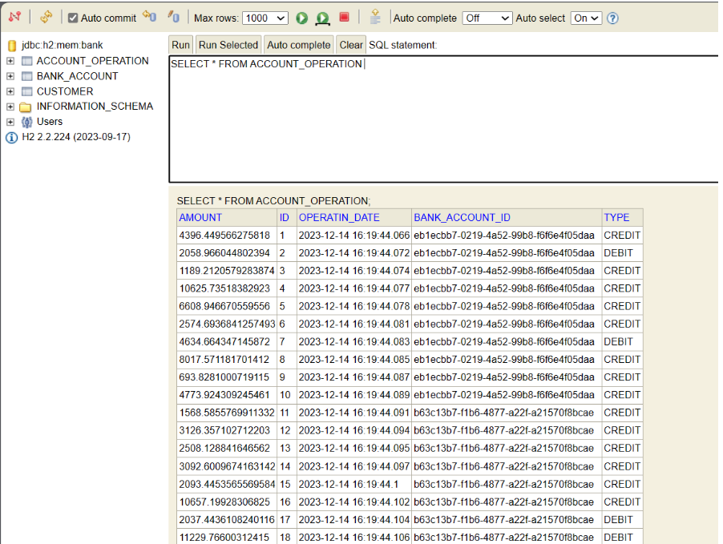
<h4>PER TABLE</h4>

 Les autres tables restent les mêmes, sauf bankAccount qui ne sera pas présente, et à la place, nous aurons deux tables : CurrentAccount et SavingAccount.

générer per table Bank Account 

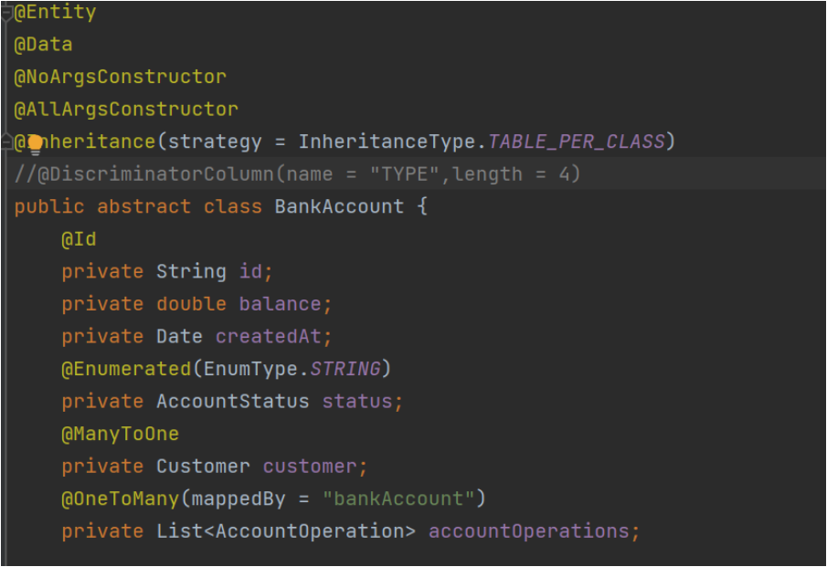

table Current Account

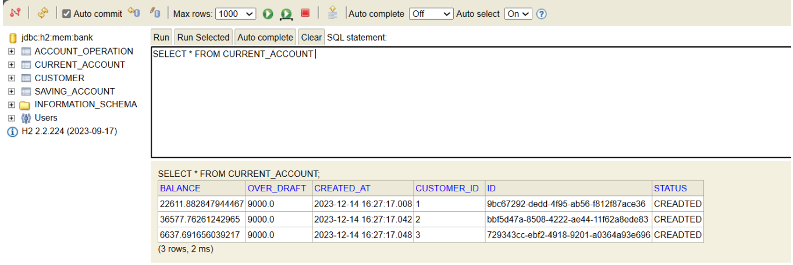

table Saving Account

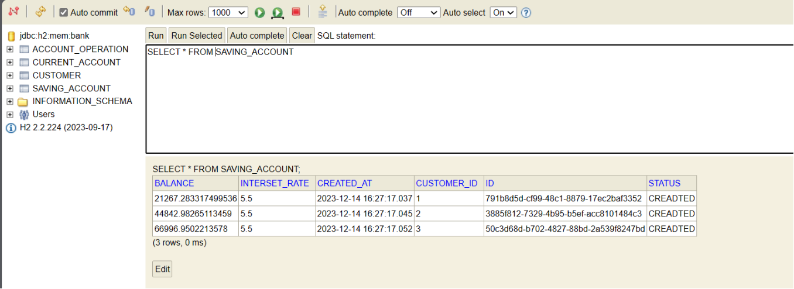

<h4>Joined</h4>

 Les autres tables restent les mêmes, sauf bankAccount, CurrentAccount, SavingAccount qui seront modifiées.

générer joined table

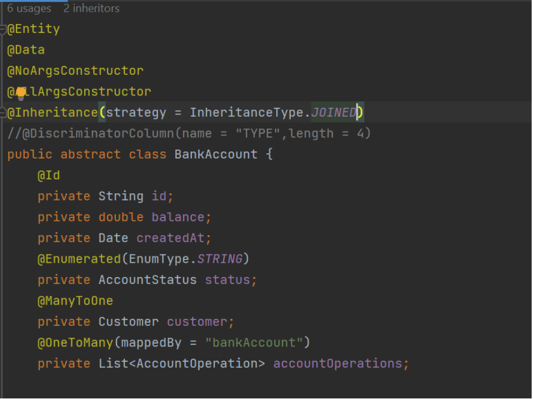

table Saving Account

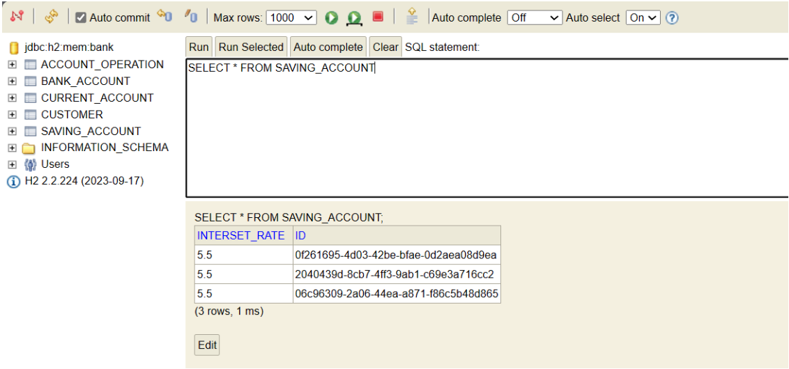

table Current Account

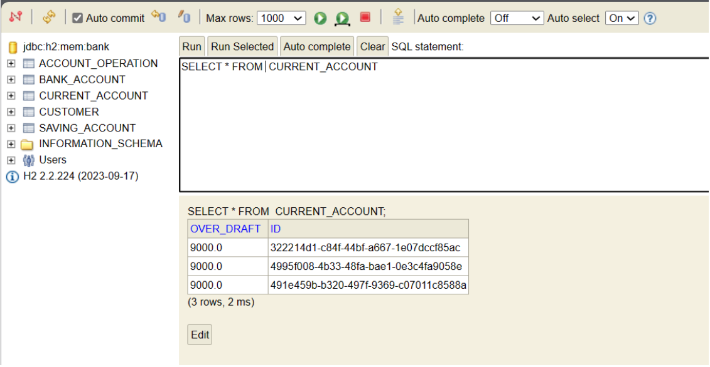

table Bank Account

<h3>SQL</h3>

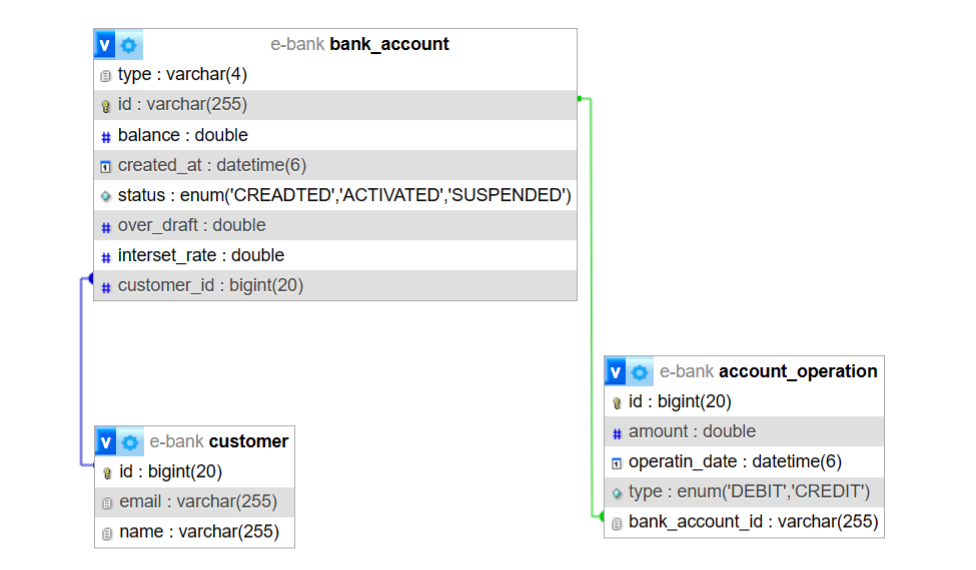
<li>Interfaces JPA Repository :</li>

<li><h2>Test de la Couche DAO :</h2></li>
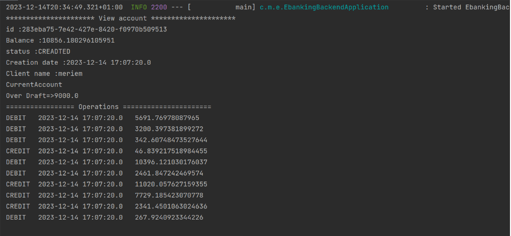
<li>Couche Service et DTOs :</li>

On a afficher la liste des customers 

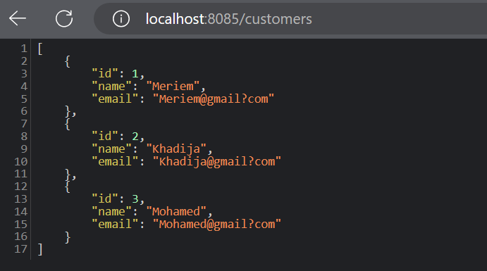

</ol>
